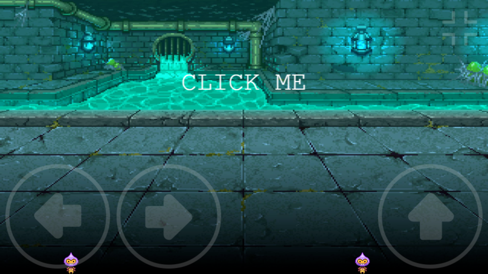

# PeerPlay – A Real-Time Offline LAN Multiplayer Game Demo

[](https://phaser.io/)
[]()
[](LICENSE)

# 🎮 PeerPlay – A Real-Time Offline LAN Multiplayer Game Demo

PeerPlay is a Phaser 3-based LAN multiplayer game that allows real-time gameplay between players connected on the same network. It uses `geckos.io` for fast P2P communication and runs on a local Express server. Play it solo (using multiple tabs) or connect multiple devices over LAN.

---

## 🚀 Getting Started

### 1. Navigate into the project folder:

```bash
cd PeerPlay-A-Real-Time-Offline-LAN-Multiplayer-Game-Demo
```

### 2. Install all dependencies:

```bash
npm install
```

### 3. Start the development server:

```bash
npm run dev
```

---

## 📷 Screenshots

### 🔗 Initial State


---
## 🕹️ How to Play 

### ✅ Option 1: Try Alone (Using Two Tabs)

- Open **two tabs** or **two separate browser windows**.
- In both tabs, visit:

```bash
http://localhost:8080
```

This simulates two players on the same machine.

---

### 🌐 Option 2: Play with Friends Over LAN

- Make sure all devices are on the **same Wi-Fi** or **mobile hotspot**.
- Get your local IP address on the host system:

```bash
# For Windows:
ipconfig

# For Linux/macOS:
ifconfig
```

- Find the IP address (e.g., `192.168.1.10`) and open this in the browser of each device:

```bash
http://192.168.1.10:8080
```

Now everyone can play together over LAN!

---

## 📦 Technologies Used

| Tech        | Purpose                            |
|-------------|------------------------------------|
| Phaser 3    | Game rendering engine              |
| geckos.io   | Real-time communication over LAN   |
| Express.js  | Backend web server                 |
| Webpack     | Module bundler for client-side code|
| Axios       | HTTP request handling              |
| Nodemon     | Live-reload during development     |

---

## 📝 License

This project is licensed under the **MIT License** – feel free to use, modify, and share.

---

## 📬 Contact

**Author:** Suraj Kulal  
Have suggestions or ideas?  
- Open an issue  
- Submit a pull request  
- Let’s build it better together!

Happy Coding! 🎉
